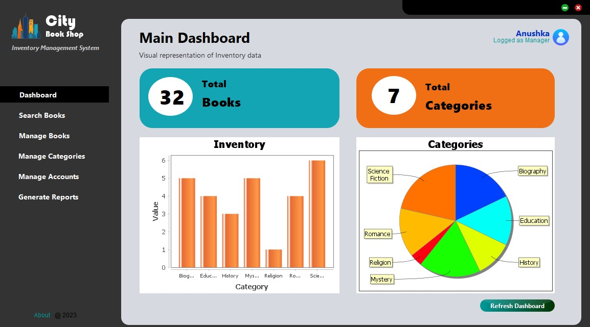
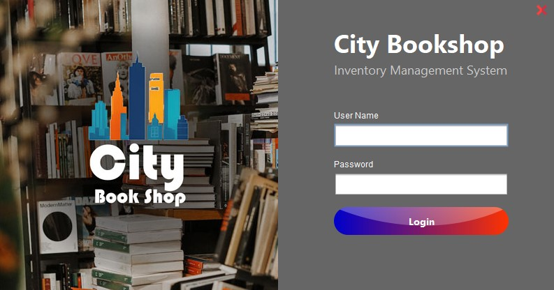
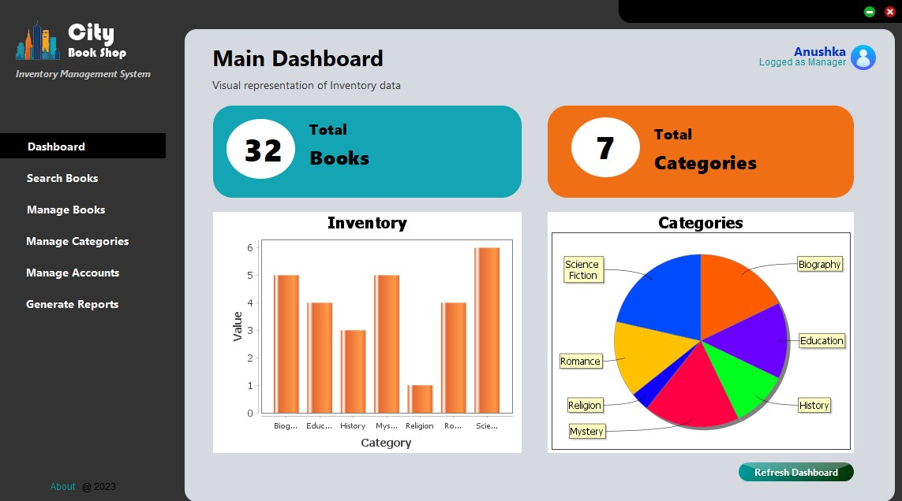
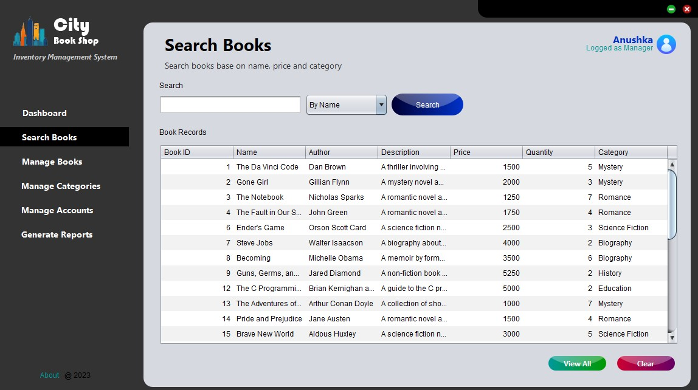
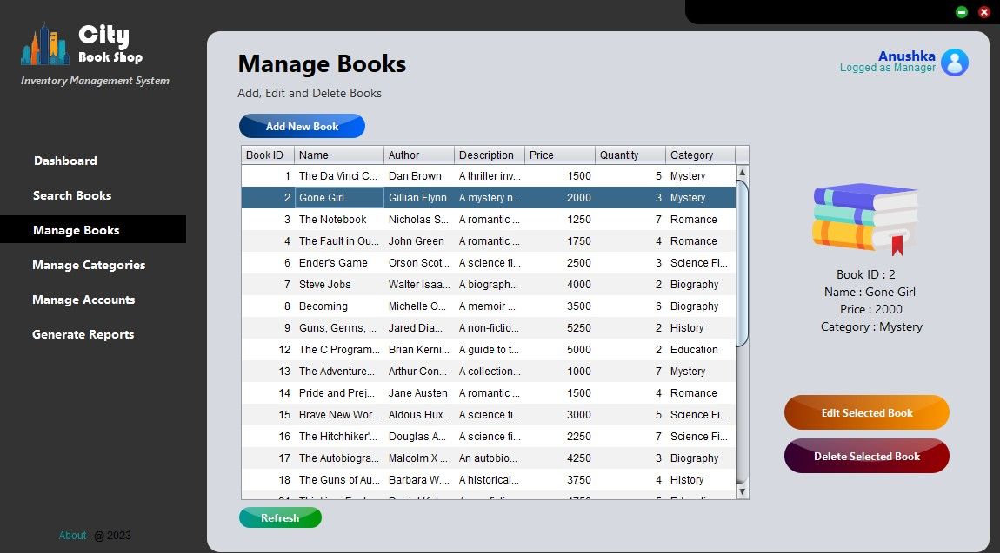
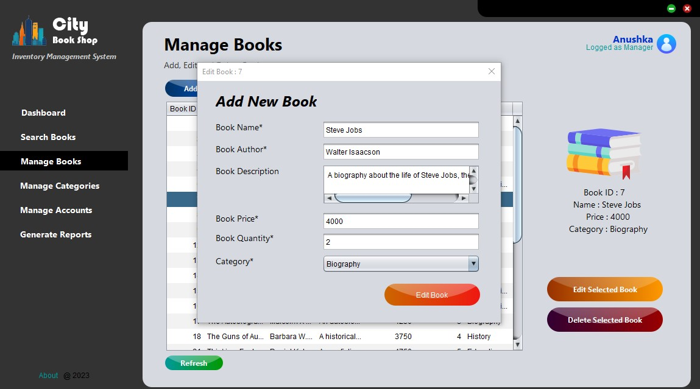
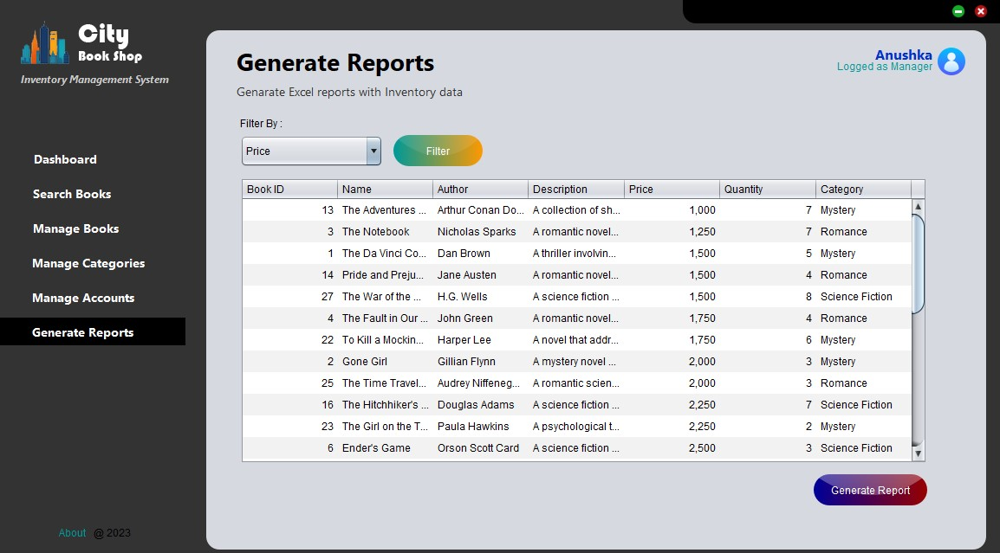

# City Bookshop Inventory Management System

This City bookshop inventory management system created using Java Ant, SQLite.

Java swing UI / UX design and Development

## Main Dashboard

---

## Features

- Vitualize Inventory data (Charts)
- Manage Book stocks (Add,Edit or delete)
- Search Books (Based on Name, Price, Category)
- Manage Book Category
- Manage User Accounts (Manager, Cashier)
- Generate Excel Reports

## Tech Stack

- Java Ant
- SQLite

## IDE

- Apache NetBeans IDE 15

## Application Screenshots

---
Login

Dashboard

Book Search

Manage Book

Edit Book

Generate Reports

## End

---
**This Application is Designed and Developed by Anushka Lakshan**

